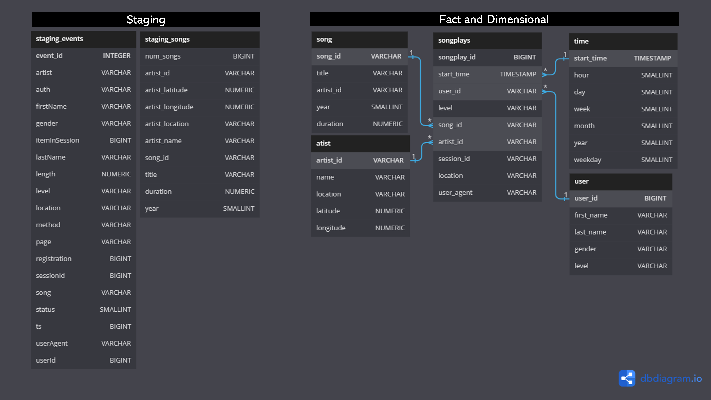

# Udacity Data Engineering Nanodegree Project: Data Warehouse

This project consists of building a data warehouse in AWS Redshift for the music streaming startup Sparkify. Their data is currently stored in json files in AWS S3.

___
## Setup and how to run

1. Fill the `dwh.cfg` configuration file with: 
    - *AWS* credentials (key and secret).
    - *DWH* data warehouse settings (cluser type, number of nodes, node type, IAM role name, database name, database user, database password and database port).
    - *S3* bucket information (source data bucket names).

2. Run `cluster-setup-and-test.ipynb` (until step 4) to create the data warehouse.

3. Run `python create_tables.py` to create the staging and analytics tables in the data warehouse.

4. Run `python etl.py` to insert the source data stored in AWS S3 into the data warehouse tables. 

5. Run `cluster-setup-and-test.ipynb` (step 5) to query the analytics tables.

6. Run `cluster-setup-and-test.ipynb` (step 6) to clean up the allocated resources in AWS.

___
## Data Source

Sparkify's data was stored in two buckets in AWS S3.

### **songs**
- bucket: `s3://udacity-dend/song_data`
- description: metadata about a song and the artist of that song.
- schema: {"num_songs": 1, "artist_id": "ARJIE2Y1187B994AB7", "artist_latitude": null, "artist_longitude": null, "artist_location": "", "artist_name": "Line Renaud", "song_id": "SOUPIRU12A6D4FA1E1", "title": "Der Kleine Dompfaff", "duration": 152.92036, "year": 0}

### **events (log)**
- bucket: `s3://udacity-dend/log_data`
- description: app activity logs.
- schema: stored in a json file (located in `s3://udacity-dend/log_json_path.json`) of meta information that is required by AWS to correctly load the log data.

___
## Data warehouse

The source data (songs and logs) was copied into two staging tables, from which the analytics tables (1 fact table and 4 dimensional tables) in a star schema were built.



___
### Staging tables

#### **staging_events**
This table is built by copying the data from `s3://udacity-dend/log_data`. 

#### **staging_songs**
This table is built by copying the data from `s3://udacity-dend/song_data`. 

___
### Analytics tables

#### Fact tables

##### **songplays**
- description: records in event data associated with song plays i.e. records with page
- cols: songplay_id, start_time, user_id, level, song_id, artist_id, session_id, location, user_agent

#### Dimension tables

##### **users**
- description: users in the app
- cols: user_id, first_name, last_name, gender, level

##### **songs**
- description: songs in music database
- cols: song_id, title, artist_id, year, duration

##### **artists**
- description: artists in music database
- cols: artist_id, name, location, lattitude, longitude

##### **time**
- description: timestamps of records in songplays broken down into specific units
- cols: start_time, hour, day, week, month, year, weekday

## Query examples
___
You can try to answer business questions about the Sparkify songs database using the analytics tables above.

* Get the top 10 listened songs:

```
SELECT 
    TOP 10 
    s.title AS song, 
    COUNT(*) AS times_listened
FROM 
    songplay AS sp
    JOIN songs AS s 
        ON sp.song_id = s.song_id
GROUP BY s.title
ORDER BY times_listened DESC
```

